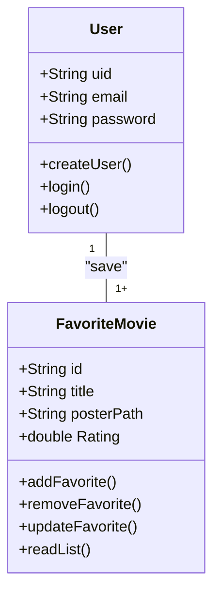

# CineFavorite - Formativa
Construir um Aplicativo do Zero - O CineFavorite permitirá criar uma conta e buscar filmes em uma API e montar uma galeria pessoal de filmes favoritos, com posters e notas

## Objetivos
- Criar uma Galeria Personalizada por Usuário de Filmes Favoritos 
- Conecar o APP com uma API( base de Dados) de Filmes
- Permitir a Criação de Contar para Cada Usuário
- Listar Filmes por Palavra-Chave


## levantamento de Requistos do Projeto
- ### Funcionais 

- ### não Funcionais

## Recursos do Projeto
- Flutter /Dart
- FireBase ( Authentication / FireStore DataBase)
- API TMDB
- Figma
- VsCode

## Diagramas

1. ### Classes
    Demonstrar o Funcionamento das Entidades do Sistema
    - Usuario (User) : classe já modela pelo FirebaseAuth
        - email
        - password
        - uid
        - login()
        - create()
        - logout()

    - FilmeFavorito: Classe modelada pelo DEV
        - number:id
        - String: Título
        - String: Poster
        - double: Rating
        - adicionar()
        - remover()
        - listar()
        - updateNota()


2. ### Uso
    Ações que os Atores podem FAzer
    - User:
        - Registrar
        - Login
        - logout
        - Procurar Filmes API
        - SAlvar Filmes Favoritos
        - Dar Nota aos Filmes
        - Remover dos Favoritos 

```mermaid
graph TD
    subgraph "Ações"
        uc1([Register])
        uc2([Login])
        uc3([LogOut])
        uc4([Search Movie])
        uc5([Favorite Movie])
        uc6([Rating Movie])
        uc7([Remove Favorite Movie])
    end

    user([Usuário])

    user --> uc1 
    user --> uc2 
    user --> uc3 
    user --> uc4 
    user --> uc5 
    user --> uc6 
    user --> uc7

    uc1 --> uc2
    uc2 --> uc3
    uc2 --> uc4
    uc2 --> uc5
    uc2 --> uc6
    uc2 --> uc7

```


3. ### Fluxo
    Determina o Caminho percorrido pelo aTor para executar uma ação

    - Ação de Login

```mermaid

graph TD

    A[Ínicio] --> B {Login Usuário}
    B --> C[Inserir Email e Senha] 
    C --> D{Validar as Credenciais}
    D --> E[Sim]
    E --> F[Tela de Favoritos]
    D --> G[Não]
    G --> B

```

## Prototipagem

Figma: https://www.figma.com/design/fpBodWKN72kXf5rWEKqXFK/Untitled?node-id=0-1&t=2hscAcqYQW7rpR8h-1


## Codificação